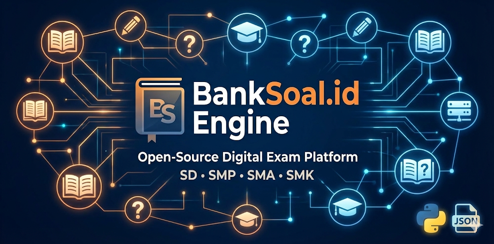

# 📚 BankSoal.id Engine

**Platform Latihan Soal Digital Open-Source Terlengkap**
*Generate website bank soal statis dengan Python, JSON, dan GitHub Pages.*

[🌐 Buka Website](https://spacenet.my.id) · [🐞 Lapor Bug](https://github.com/DHEWAYY/bank_soal/issues)

---

## 🔥 Fitur Utama
* **Generate Otomatis:** Ubah data JSON jadi website HTML statis super cepat.
* **Support Word:** Otomatis bikin file `.docx` buat user yang mau download soal.
* **AdSense Ready:** Udah tertanam slot iklan & `ads.txt` otomatis.
* **SEO Friendly:** Struktur HTML rapi, meta tag lengkap, dan loading ngebut.
* **Gratis Hosting:** Didesain khusus buat jalan di GitHub Pages via Cloudflare.

## 🛠️ Teknologi
* **Engine:** Python 3
* **Database:** JSON Files
* **Frontend:** Tailwind CSS (CDN)
* **Hosting:** GitHub Pages
* **CDN & DNS:** Cloudflare

## 🚀 Cara Pakai
1.  Masukkan file soal (JSON) ke folder `data/`.
2.  Jalankan script: `python generator.py`.
3.  Push folder `docs/` ke GitHub.
4.  Selesai! Website otomatis terupdate.

---
&copy; 2026 BankSoal.id Project by Dhewayy.